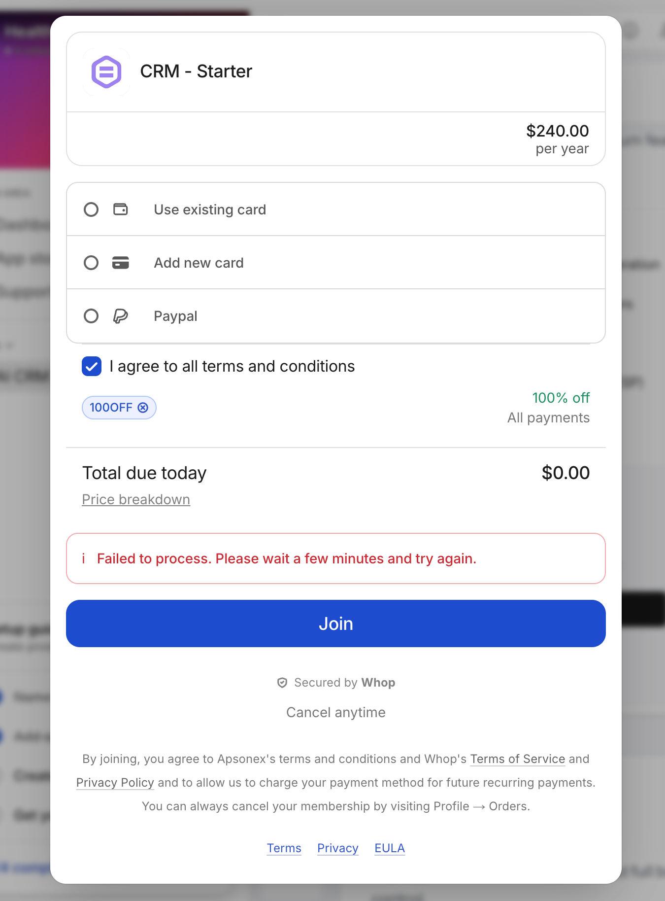
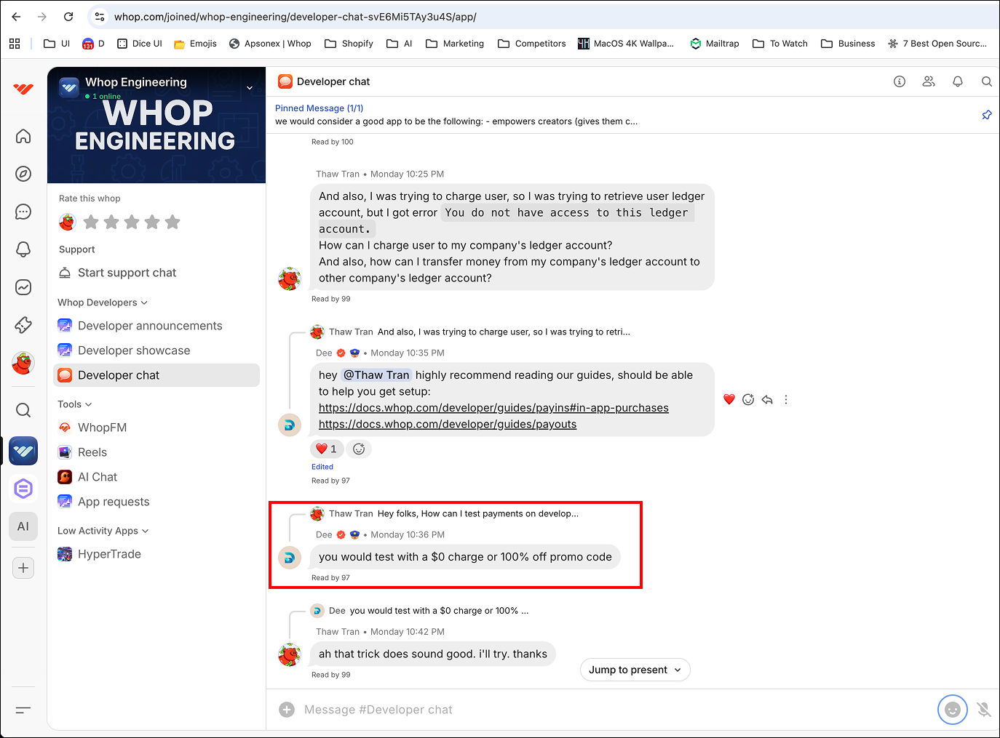

# Issue
`inAppPurchase` method trigger error `Failed to process. Please wait a few minutes and try again.`. The error is consistent even if tried after a day. I am trying it with 100% off coupon. Read below about `Payment Testing Instruction`. It does not matter if we use credit card or even paypal account. None of the payment gone through.

## Current Status
Unresolved.

## Notable to subscribe users.
As a result of the issue, our app will not able to provide subscriptions to the users.

## App Structure
Its Vuejs Single page SPA.

## Checkout code
As per whop document for [iframe sdk](https://docs.whop.com/developer/guides/iframe#other-frameworks), we have added and initialized `iframeSdk` and invoke `inAppPurchase` method with all the required parameter. It then open the checkout popup and user is able to enter payment info with promo code. Once user click `Subscribe` button, it didn't complete.

```vue
<template>
    <WhopLayout title="Subscriptions" contentClass="p-0 bg-transparent">
        <div class="flexc">
            <div class="flexc w-full p-6" v-if="data.starting === true">
                <LoadingMark />
            </div>
            <SubscriptionPlans :plans="data.plans" @plan-selected="planSelected" v-else />
        </div>
    </WhopLayout>
</template>

<script setup>
import SubscriptionPlans from '@/components/SubscriptionPlans.vue';
import useApiClient from '@/composables/useApiClient';
import WhopLayout from '@/layouts/WhopLayout.vue';
import { usePage } from '@inertiajs/vue3';
import { onBeforeMount, reactive } from 'vue';
import * as whop from "@whop/iframe";
import LoadingMark from '@/components/LoadingMark.vue';
import api from '@/routes/api';
import { toast } from 'vue-sonner';

const { apiClient } = useApiClient();
const { props } = usePage();

const data = reactive({
    starting: false,
    loading: false,
    checkout_id: null,
    plan_id: null,
    plans: [],
});

onBeforeMount(() => {
    data.starting = true;
    fetchPlans();
})

async function fetchPlans() {
    const res = await apiClient().get(
        api.subscriptionPlans.index().url
    );
    data.plans = res.data.plans;
    data.starting = false;
    console.log(data.plans);
}

async function planSelected({ plan }) {

    const sdk = whop.createSdk({
        appId: props.context.appId
    });

    // const p = await sdk.ping('ping');
    // console.log(p);

    const checkoutRes = await apiClient().post(
        api.checkoutConfig.store().url,
        { planId: plan.id }
    );

    const purchaseUrl = await sdk.inAppPurchase({
        id: checkoutRes.data.config.checkout.id,
        planId: checkoutRes.data.config.checkout.plan.id,
    });

    console.log(purchaseUrl);

    if (purchaseUrl.status === 'error') {
        toast.warning('Purchase canceled!');
    } else {
        toast.success('Purchase successful!');
    }
}
</script>

```

## Error
Error preview


## Payment testing instruction
As per the whop discussion, payment testing can be done with $0 charge or 100% off PROMO Code.


## Checkout responses.
Current folder also contains checkout responses collected at various point of checkout process.
